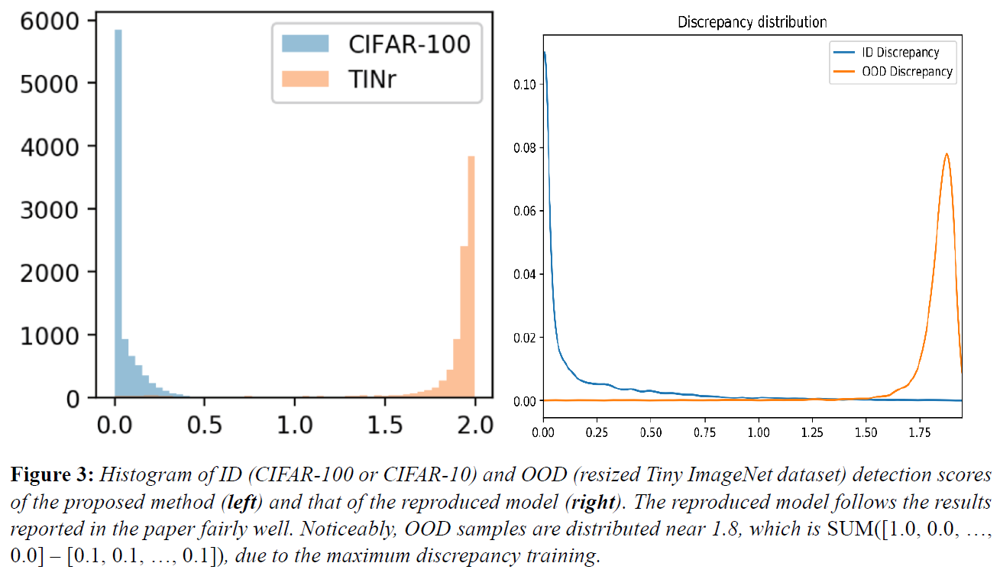
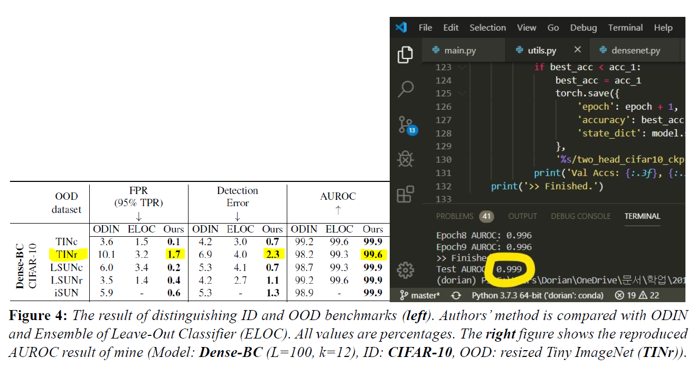
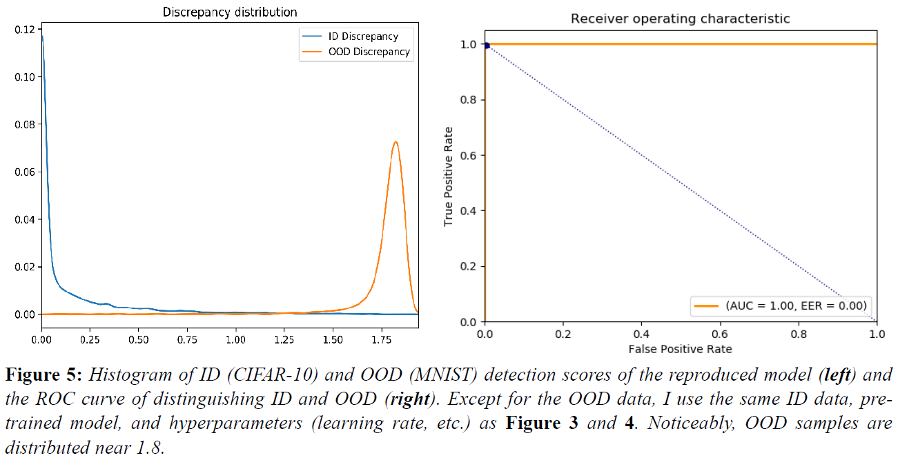
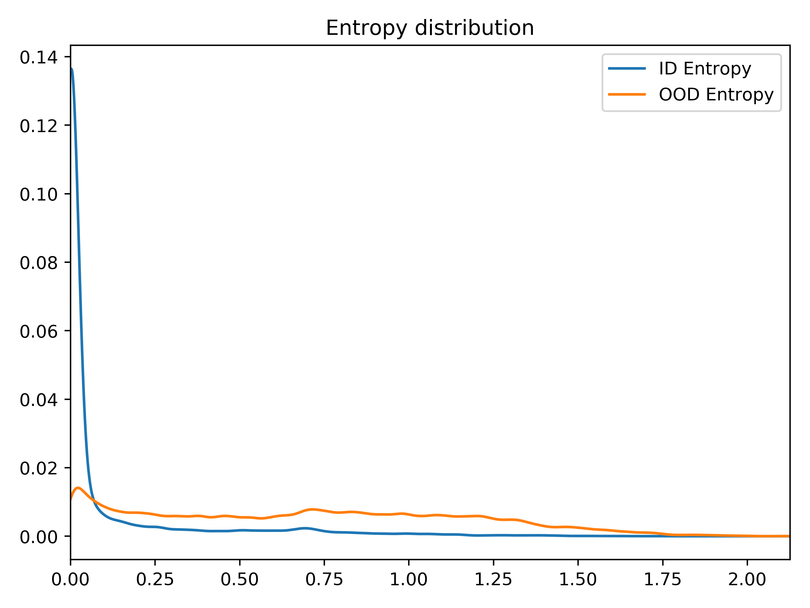

# Unsupervised Out-of-Distribution Detection by Maximum Classifier Discrepancy
 Reproducing experimental results of OOD-by-MCD [Yu and Aizawa, ICCV 2019]

*Disclaimer*
Since the description of the fine-tuning procedure is ambiguous and not sufficient to write code that reproduces the reported results, I repeated experiments several times with a variety of tweaks on my own. The main difference is that in the fine-tuning step, I set the learning rate to 0.001 instead of the reported value (0.1). Besides, since it was unclear whether the loss formula (3) used in the fine-tuning step is the aggregated loss of step A and step B or the loss used only in step B, I just chose the former empirically (see the fine_tune function in utils.py).

# Reproduced Results
 DenseNet-BC(L=100, k=12), ID = CIFAR-10, OOD = TinyImageNet(resized ver.)

 

 

 

 

# Requirements
 torch >= 1.1.0

 numpy >= 1.16.2

 tqdm >= 4.31.1

 visdom >= 0.1.8.8

# To Activate Visdom Server
  visdom

  or 

  python -m visdom.server

# Contact
 ciy405x@kaist.ac.kr